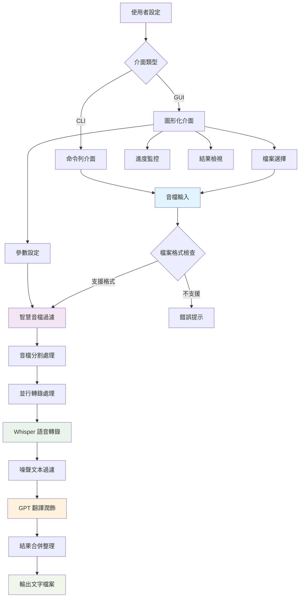
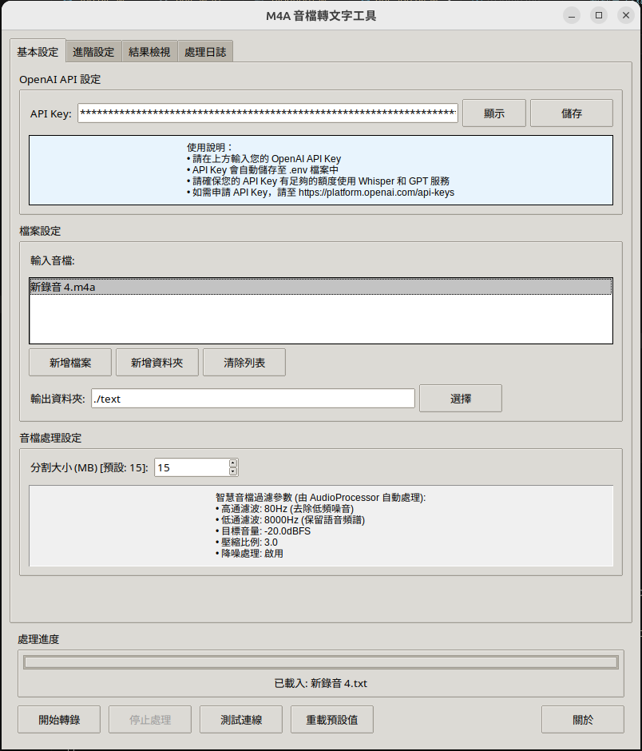
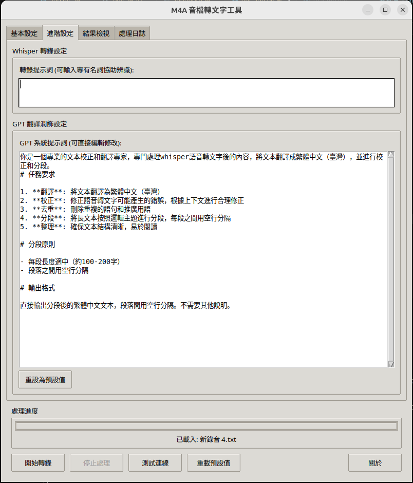
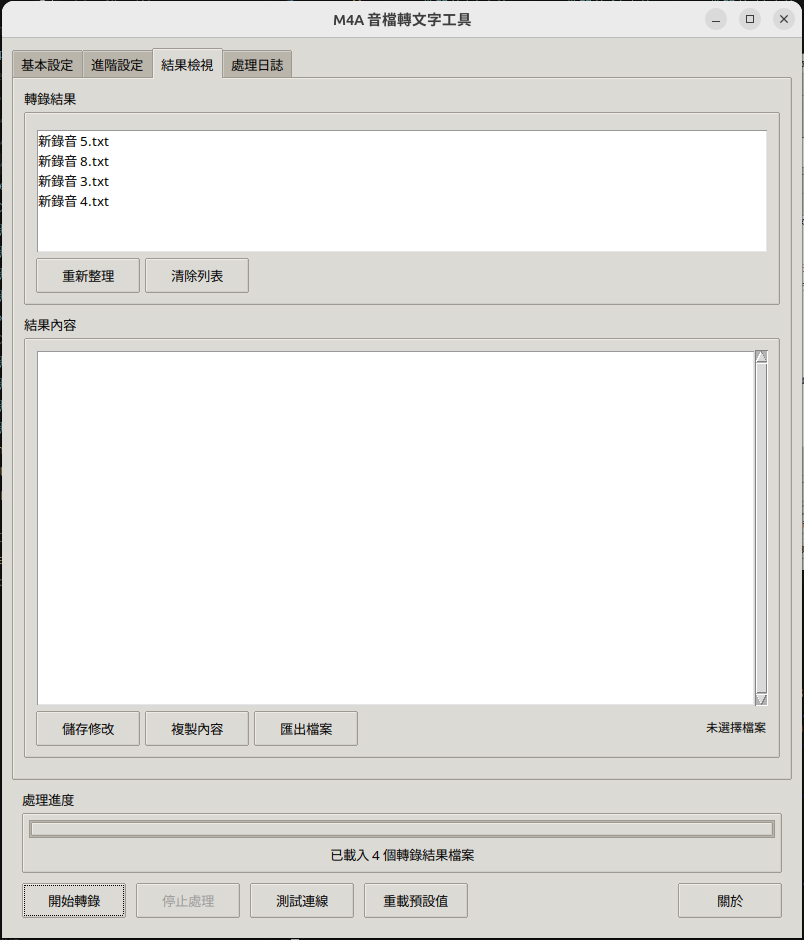
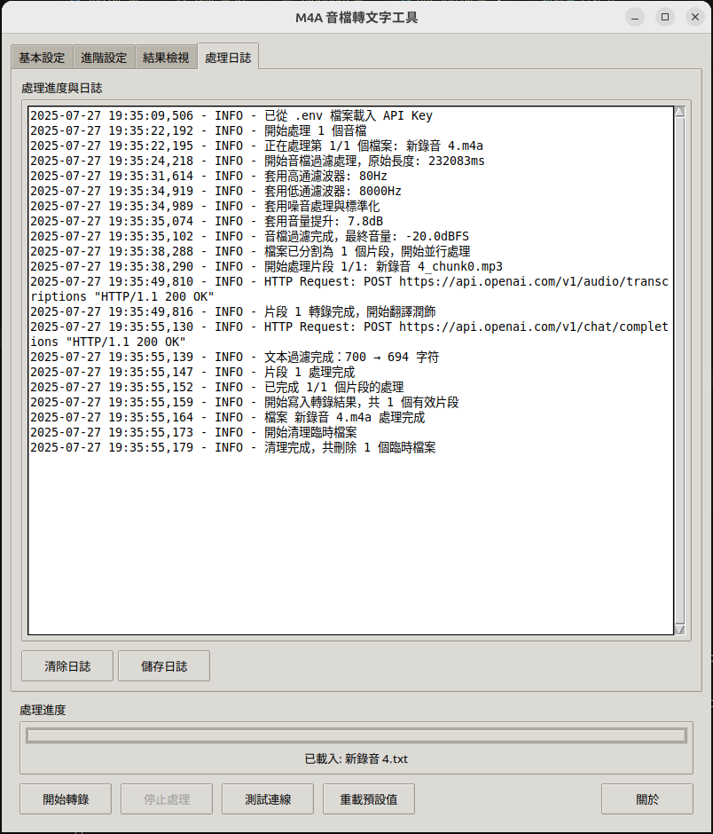
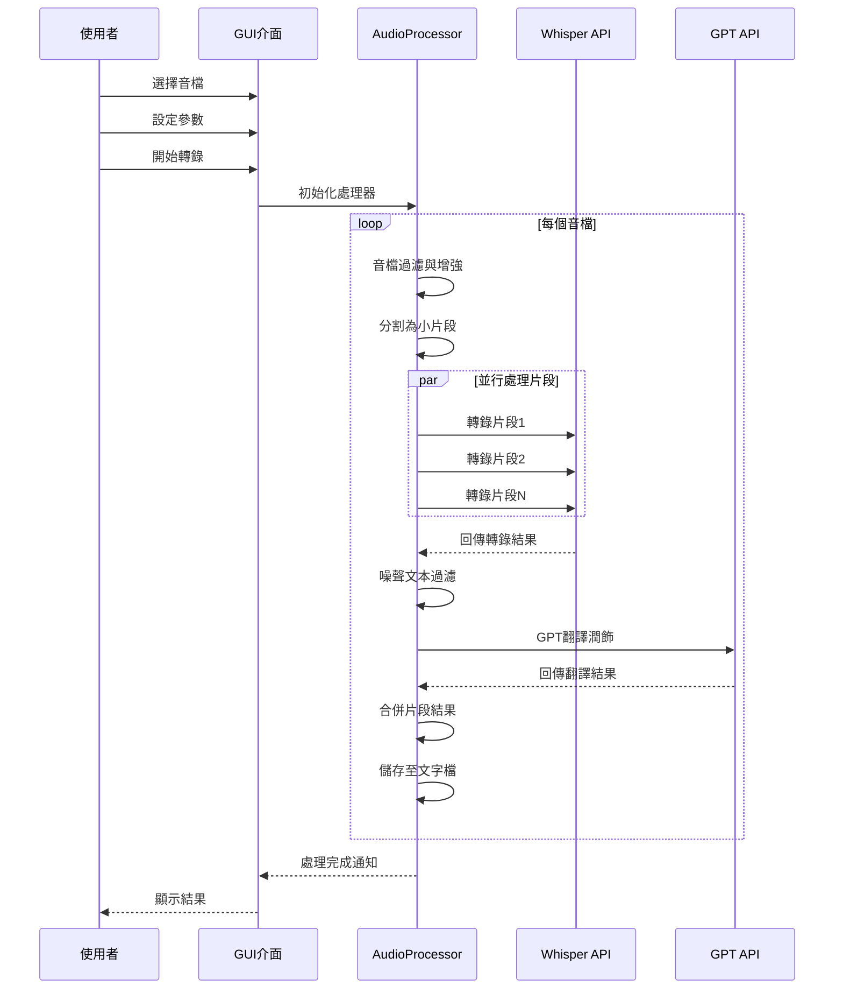

# M4A 音檔轉文字工具

[](https://python.org)
[](https://openai.com)
[](LICENSE)
[](https://deepwiki.com/sheng1111/M4A-Transcriber-TW)

一個功能完整的音檔轉錄與翻譯工具，支援多種音檔格式，提供智慧音檔過濾、高精度語音轉錄以及 GPT 潤飾翻譯功能。

## ✨ 功能特色

### 🎵 音檔處理
- **多格式支援**：M4A、MP3、WAV、FLAC、AAC 等主流音檔格式
- **智慧音檔過濾**：自動降噪、頻帶過濾、動態範圍壓縮
- **自動分割**：將大檔案智慧分割為適合 API 處理的片段
- **批次處理**：支援同時處理多個音檔

### 🎯 語音轉錄
- **OpenAI Whisper**：業界領先的語音識別模型
- **自訂提示詞**：可輸入專有名詞協助辨識精度
- **噪聲過濾**：自動移除轉錄結果中的無效內容

### 🌏 智慧翻譯
- **GPT-4.1 翻譯**：高品質的語意理解與翻譯
- **繁體中文（臺灣）**：本地化的語言習慣
- **智慧分段**：按邏輯主題自動分段整理
- **內容校正**：修正語音轉文字的常見錯誤

### 🖥️ 使用介面
- **圖形化介面**：直覺易用的 GUI 操作介面
- **命令列工具**：適合自動化批次處理
- **即時進度**：完整的處理進度與日誌顯示
- **結果管理**：內建檢視、編輯、匯出功能

## 🏗️ 系統架構



## 📦 環境建置

### 系統需求
- Python 3.7 或更高版本
- FFmpeg（用於音檔處理）
- OpenAI API Key

### 安裝步驟

1. **克隆專案**
   ```bash
   git clone https://github.com/sheng1111/M4A-Transcriber-TW.git
   cd M4A-Transcriber-TW
   ```

2. **安裝 Python 依賴**
   ```bash
   pip install -r requirements.txt
   ```

3. **安裝 FFmpeg**
   
   **Ubuntu/Debian:**
   ```bash
   sudo apt update
   sudo apt install ffmpeg
   ```
   
   **macOS:**
   ```bash
   brew install ffmpeg
   ```
   
   **Windows:**
   下載並安裝 [FFmpeg](https://ffmpeg.org/download.html)

4. **安裝 PortAudio (錄音裝置支援)**

   **Ubuntu/Debian:**
   ```bash
   sudo apt-get update
   sudo apt-get install portaudio19-dev
   ```

   **macOS:**
   ```bash
   brew install portaudio
   ```

   **Windows:**
   建議使用 [pipwin](https://github.com/lepisma/pipwin) 安裝：
   ```bash
   pip install pipwin
   pipwin install pyaudio
   ```

5. **設定 API Key**
   
   建立 `.env` 檔案：
   ```bash
   OPENAI_API_KEY=your_openai_api_key_here
   ```

## 🚀 使用方式

### 圖形化介面（推薦）

```bash
python gui_app.py
```

#### GUI 功能說明

<table>
<tr>
<td width="50%">

**1. 基本設定頁面**
- OpenAI API Key 設定與儲存
- 輸入檔案選擇（支援單檔或整個資料夾）
- 輸出資料夾設定



</td>
<td width="50%">

**2. 進階設定頁面**
- Whisper 轉錄提示詞設定
- GPT 系統提示詞自訂
- 重設為預設值功能



</td>
</tr>
<tr>
<td width="50%">

**3. 結果檢視頁面**
- 轉錄結果列表顯示
- 內容預覽與編輯
- 儲存修改、複製、匯出功能



</td>
<td width="50%">

**4. 處理日誌頁面**
- 即時處理進度顯示
- 詳細日誌記錄
- 日誌儲存功能



</td>
</tr>
</table>

### 命令列介面

可直接透過參數指定要處理的檔案與輸出位置：

```bash
python app.py -i ./speech/example.m4a ./speech/example2.m4a \
             -o ./text/output.txt \
             --whisper-prompt "包含特殊詞彙或人名" \
             --gpt-system-prompt "自訂的翻譯指令"
```

## 📁 目錄結構

```
M4A-Transcriber-TW/
├── app.py                 # 核心音檔處理器（命令列版本）
├── gui_app.py             # 圖形化使用者介面
├── requirements.txt       # Python 依賴套件
├── .env                   # 環境變數設定檔案
├── .gitignore            # Git 忽略檔案規則
├── LICENSE               # 授權條款
├── README.md             # 本說明文件
├── speech/               # 音檔輸入目錄
│   └── ...
└── text/                 # 轉錄結果輸出目錄
    └── ...
```

## ⚙️ 配置說明

### 音檔過濾參數

系統會自動套用以下智慧過濾參數，最佳化語音清晰度：

| 參數 | 預設值 | 說明 |
|------|--------|------|
| 高通濾波 | 80Hz | 去除低頻噪音（空調、風扇等） |
| 低通濾波 | 8000Hz | 保留語音頻譜，去除高頻噪音 |
| 目標音量 | -20.0dBFS | 標準化音量水平 |
| 壓縮比例 | 3.0 | 平衡音量差異 |
| 降噪處理 | 啟用 | 智慧噪音抑制 |
| 分割大小 | 15MB | API 處理的最大檔案大小 |

### GPT 系統提示詞

預設的 GPT 系統提示詞針對繁體中文（臺灣）進行最佳化：

```
你是一個專業的文本校正和翻譯專家，專門處理whisper語音轉文字後的內容，
將文本翻譯成繁體中文（臺灣），並進行校正和分段。

任務要求：
1. 翻譯: 將文本翻譯為繁體中文（臺灣）
2. 校正: 修正語音轉文字可能產生的錯誤
3. 去重: 刪除重複的語句和推廣用語
4. 分段: 將長文本按照邏輯主題進行分段
5. 整理: 確保文本結構清晰，易於閱讀
```

## 🔄 處理流程



## 🛠️ 進階用法

### 自訂音檔過濾參數

如需調整音檔過濾參數，可修改 `AudioProcessor` 類別中的 `filter_audio` 方法：

```python
def filter_audio(self, audio, 
                 high_pass_freq=100,      # 調整高通濾波頻率
                 low_pass_freq=7000,      # 調整低通濾波頻率
                 target_dBFS=-18.0,       # 調整目標音量
                 compression_ratio=2.5,   # 調整壓縮比例
                 enable_noise_reduction=True):
```

### 批次處理腳本

建立自訂批次處理腳本：

```python
from app import AudioProcessor
import os

def batch_process():
    processor = AudioProcessor()
    
    # 處理整個資料夾
    audio_files = []
    for file in os.listdir('./speech'):
        if file.endswith(('.m4a', '.mp3', '.wav')):
            audio_files.append(os.path.join('./speech', file))
    
    for audio_file in audio_files:
        output_file = f"./text/{os.path.splitext(os.path.basename(audio_file))[0]}.txt"
        processor.process_files([audio_file], output_file)

if __name__ == "__main__":
    batch_process()
```

## 🐛 疑難排解

### 常見問題

**Q: API Key 設定後仍然無法使用**
- 確認 `.env` 檔案位於專案根目錄
- 檢查 API Key 是否正確且有足夠額度
- 確認網路連線正常

**Q: 音檔轉錄結果為空**
- 檢查音檔是否損壞或格式不支援
- 確認音檔中確實包含語音內容
- 嘗試調整音檔過濾參數

**Q: FFmpeg 相關錯誤**
- 確認已正確安裝 FFmpeg
- 檢查 FFmpeg 是否已加入系統 PATH
- Linux 用戶確認路徑設定：`/usr/bin/ffmpeg`

**Q: GUI 介面無法啟動**
- 確認已安裝所有必要的 Python 套件
- 檢查 Tkinter 是否正確安裝（通常隨 Python 附帶）

### 效能最佳化

- **並行處理**：系統預設使用 2 個執行緒並行處理音檔片段
- **記憶體管理**：大型音檔會自動分割以避免記憶體溢位
- **暫存清理**：處理完成後會自動清理臨時檔案

## 📊 支援格式

| 格式 | 副檔名 | 狀態 |
|------|--------|------|
| M4A | .m4a | ✅ 完全支援 |
| MP3 | .mp3 | ✅ 完全支援 |
| WAV | .wav | ✅ 完全支援 |
| FLAC | .flac | ✅ 完全支援 |
| AAC | .aac | ✅ 完全支援 |

## 🤝 貢獻

歡迎提交 Issue 和 Pull Request 來改善這個專案！

## 📄 授權條款

本專案採用 MIT 授權條款 - 詳見 [LICENSE](LICENSE) 檔案

## 🔗 相關連結

- [OpenAI API 文檔](https://platform.openai.com/docs)
- [Whisper 模型說明](https://openai.com/research/whisper)
- [FFmpeg 官方網站](https://ffmpeg.org/)

---

**開發者：** Sheng1111  
**版本：** 2.1 - 整合API設定與基本設定  
**最後更新：** 2025年7月

*如果這個工具對您有幫助，請給個 ⭐ 星星！*
