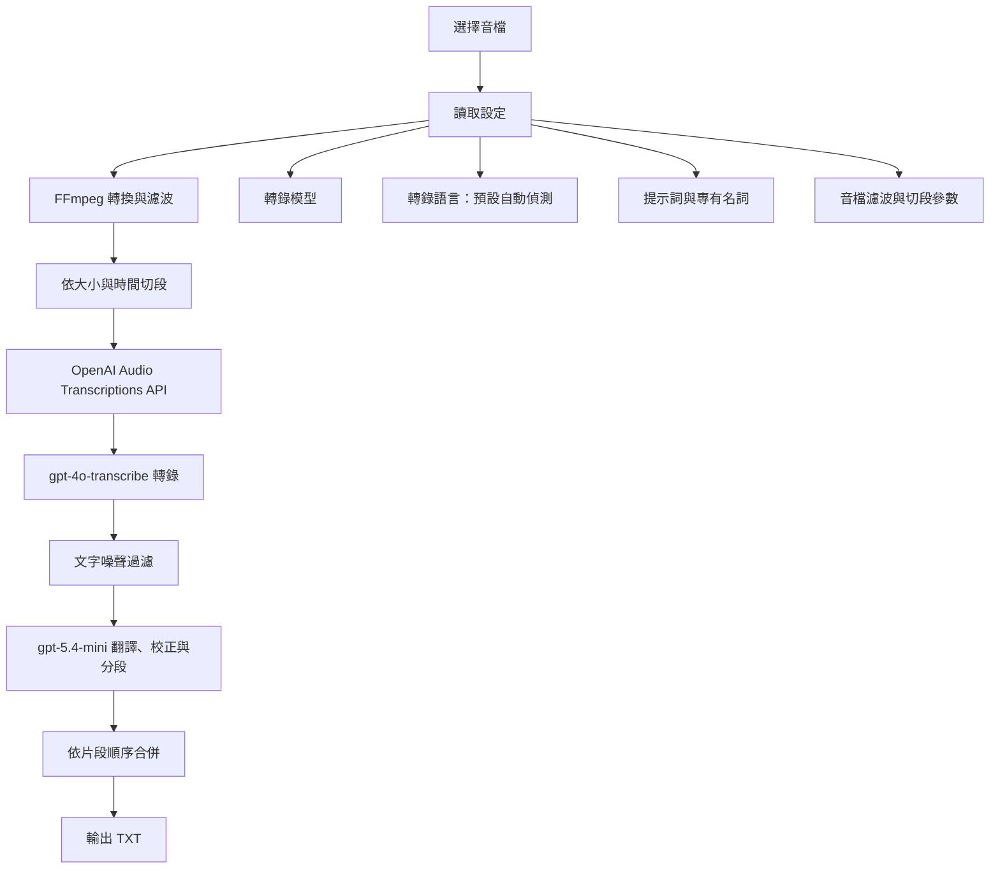

# M4A Transcriber TW

M4A Transcriber TW 是一個以 OpenAI API 為核心的音檔轉錄與繁體中文整理工具。支援命令列與 Tkinter GUI，可批次處理 M4A、MP3、WAV、FLAC、AAC 等常見音檔，並將轉錄內容翻譯、校正與分段成臺灣繁體中文。

目前版本：`2.3.0`

## 主要功能

- 使用 `gpt-4o-transcribe` 作為預設語音轉文字模型
- 使用 `gpt-5.4-mini` 作為預設翻譯與潤飾模型
- 支援轉錄模型切換：`gpt-4o-transcribe`、`gpt-4o-mini-transcribe`、`whisper-1`
- 支援自訂轉錄提示詞，適合加入人名、產品名、術語與專有名詞
- 支援自訂 GPT 系統提示詞，控制翻譯、校正與分段風格
- 長音檔自動切段，預設每段最長 10 分鐘並限制檔案大小
- 使用 FFmpeg 進行高通、低通、語音增強、壓縮與音量調整
- GUI 提供檔案選擇、進階參數、處理日誌、結果檢視與編輯

## 處理流程



## 系統需求

- Python 3.8 或更新版本
- FFmpeg 與 FFprobe
- OpenAI API Key

## 安裝

```bash
pip install -r requirements.txt -U
```

安裝 FFmpeg：

```bash
# Ubuntu / Debian
sudo apt update
sudo apt install ffmpeg

# macOS
brew install ffmpeg
```

Windows 請從 FFmpeg 官方網站下載並加入系統 PATH。

## API Key

在專案根目錄建立 `.env`：

```bash
OPENAI_API_KEY=your_openai_api_key_here
```

GUI 也可以在「基本設定」頁面輸入並儲存 API Key。

## 使用方式

### GUI

```bash
python gui_app.py
```

GUI 頁面包含：

- 基本設定：API Key、輸入音檔、輸出資料夾、音檔處理參數
- 進階設定：轉錄模型、翻譯模型、轉錄語言、提示詞。轉錄語言預設留空，代表自動偵測；需要固定語言時可填 `zh`、`en`、`ja` 等 ISO-639-1 代碼。
- 結果檢視：讀取、編輯、儲存、複製與匯出結果
- 處理日誌：查看處理進度與錯誤訊息

### 命令列

```bash
python app.py
```

預設測試檔案為：

```text
speech/新錄音 5.m4a
```

輸出檔案為：

```text
text/新錄音 5.txt
```

如需調整命令列處理檔案，請修改 `app.py` 的 `main()`。

## 重要設定

| 設定 | 預設值 | 說明 |
| --- | --- | --- |
| 轉錄模型 | `gpt-4o-transcribe` | OpenAI 語音轉文字模型 |
| 翻譯模型 | `gpt-5.4-mini` | 用於繁體中文翻譯、校正與分段 |
| 轉錄語言 | 空白 | 預設自動偵測；可指定 ISO-639-1 代碼 |
| 分割大小 | `20MB` | 單一暫存音檔大小上限 |
| 最長片段 | `10` 分鐘 | 避免單段過長造成輸出截斷 |
| 匯出格式 | MP3 96kbps / mono / 16kHz | 平衡準確性、效能與 API 檔案大小 |
| 高通濾波 | `80Hz` | 減少低頻噪音 |
| 低通濾波 | `8000Hz` | 保留語音主要頻段 |

## OpenAI 轉錄模型

本專案使用 OpenAI Audio Transcriptions API：

```python
from openai import OpenAI

client = OpenAI()

with open("speech/example.m4a", "rb") as audio_file:
    transcript = client.audio.transcriptions.create(
        model="gpt-4o-transcribe",
        file=audio_file,
        response_format="json",
        prompt="Unix, 神通, host"
    )
```

若要指定語言，可另外加入 `language="zh"`。未指定時由模型自動偵測。

`gpt-4o-transcribe` 與 `gpt-4o-mini-transcribe` 相較 Whisper 模型有更好的語言辨識與字錯率表現；本專案仍保留 `whisper-1` 作為可選回退模型。

## 目錄結構

```text
M4A-Transcriber-TW/
├── app.py
├── gui_app.py
├── requirements.txt
├── readme.md
├── speech/
│   └── 新錄音 5.m4a
└── text/
    └── 新錄音 5.txt
```

## 版本紀錄

### 2.3.0

- 預設轉錄模型改為 `gpt-4o-transcribe`
- 預設翻譯模型改為 `gpt-5.4-mini`
- 新增最長片段分鐘數，降低長音檔轉錄截斷風險
- 將暫存音檔改為 16kHz mono、96kbps MP3
- 改善 GUI 背景執行緒的狀態讀取方式
- 轉錄語言預設改為自動偵測，可由 GUI 或 CLI 指定
- 精簡 README 並更新使用說明

### 2.2

- 加入跨平台 FFmpeg 偵測
- 強化 GUI 設定、日誌與結果檢視
- 支援進階音檔濾波參數

### 2.1

- 整合 API Key 設定與基本 GUI 控制
- 加入批次處理與結果管理

## 注意事項

- 長音檔會被切成多段並平行處理，會產生多次 OpenAI API 呼叫。
- `gpt-4o-transcribe` 與 `gpt-4o-mini-transcribe` 使用 `json` 回應格式，程式會讀取其中的 `text` 欄位。
- 如果轉錄內容包含大量專有名詞，請在轉錄提示詞中明確列出。
- 轉錄語言預設自動偵測；如果音檔語言固定，指定 ISO-639-1 代碼通常可提升準確性與延遲表現。
